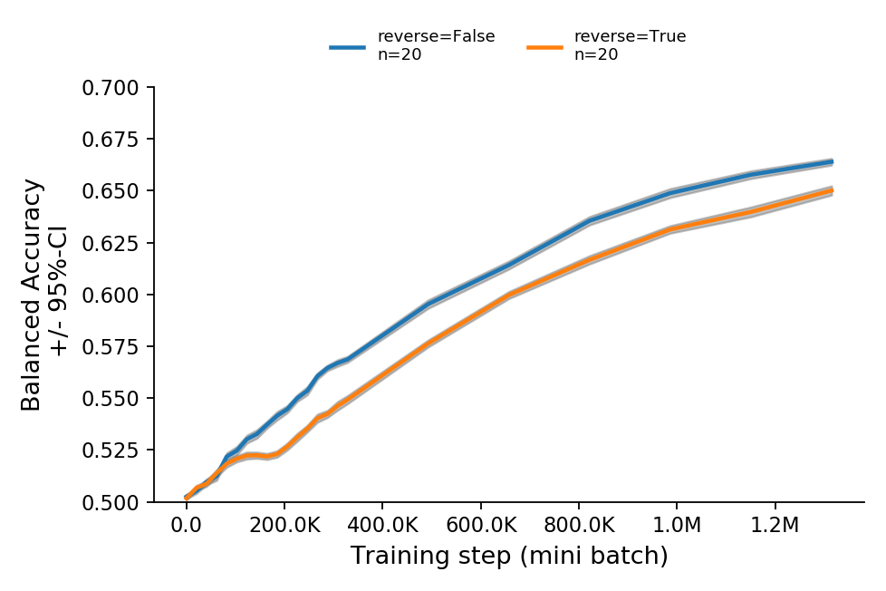

# ChildesRNNLM

Research code. Under active development.

## Background

The research paper associated with this repository can be found [here](https://osf.io/j943u/).

## Training Data

The training input consists of transcribed child-directed speech from the CHILDES database.
The text used to train the RNN is available in `data/childes-20191112.txt`. 
It was created using [CreateCHILDESCorpus](https://github.com/UIUCLearningLanguageLab/CreateCHILDESCorpus), which performs:

1) tokenization using the default tokenizer in `spacy`
2) lowercasing
3) ordering of transcripts by the age of the target child

## Research Findings

The order in which the training data is presented to the RNN facilitates 
learning semantic category distinctions between common nouns.



## Installation

First, create a new virtual environment for Python 3.7. Then:

```
pip install git+https://github.com/phueb/ChildesRNNLM
```

## Dependencies

To install all the dependencies, execute the following in your virtual environment: 

```bash
pip install -r requirements.txt
```

### Preppy

The text files are prepared for training using a custom Python package `Preppy`.
It is available [here](https://github.com/phueb/Preppy).
It performs no reordering of the input, and assumes instead that the lines in the text file are already in the order that they should be presented to the model.

### CategoryEval

Evaluation of semantic category knowledge requires the custom Python package `CategoryEval`.
It is available [here](https://github.com/phueb/CategoryEval).
It computes how well the model's learned representations recapitulate some human-created gold category structure.
By default, it returns the balanced accuracy, but F1 and Cohen's Kappa can be computed also.

### Ludwig

If you are a member of the UIUC Learning & Language lab, you can run the jobs in parallel on multiple machines.
This is recommended if multiple replications need to be run, or if no access to GPUs is otherwise available.

## Usage

The code is designed to run on multiple machines, at the UIUC Learning & Language Lab using a custom job submission system called [Ludwig](https://github.com/phueb/Ludwig).
If you have access to the lab's file server, you can submit jobs with `Ludwig`:

```bash
ludwig -e PATH-TO-PREPPY PATH-TO-CATEGORYEVAL
```

Alternatively, the experiment can be run locally:

```bash
ludwig --local
```

## Compatibility

Developed on Ubuntu 18.04 with Python 3.7
