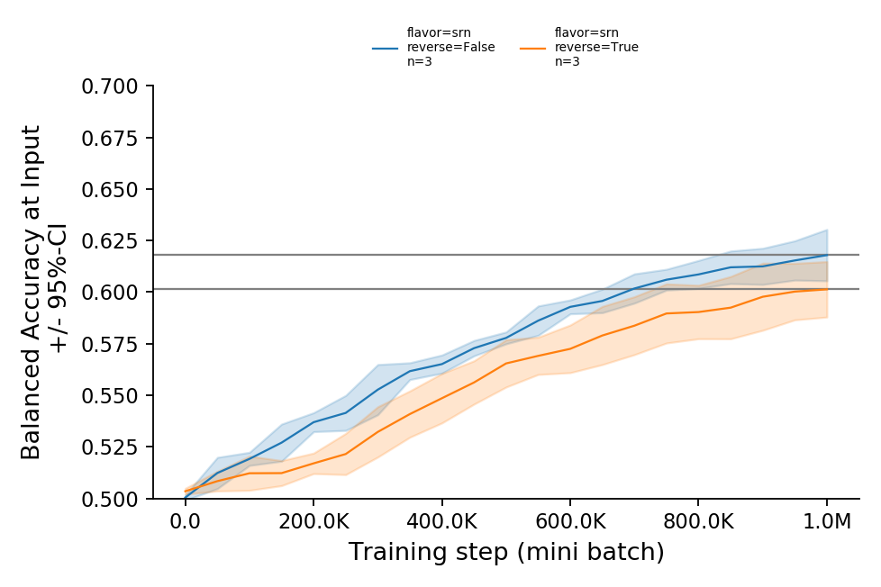
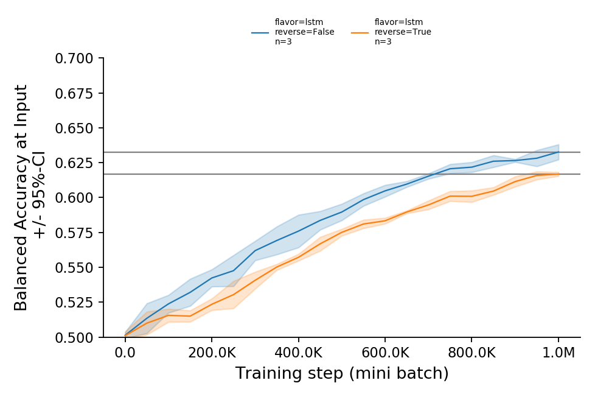

# EntropicStartTheory

Research code. No longer maintained (as of 2022)

## Background

The research paper associated with this repository can be found [here](https://osf.io/j943u/).

## Training Data

The training input consists of transcribed child-directed speech from the CHILDES database.
The text used to train the RNN is loaded, in memory, using the custom-built Python package [AOCHILDES](https://github.com/UIUCLearningLanguageLab/AOCHILDES).
After the minimally processed raw text is loaded, ordered by the age of the target child,
a ByteLevel BPE tokenizer (introduced with GPT-2) is used to build the training vocabulary and for tokenization.

Note: The age-order effect occurs independent of tokenization choice,
 as it has been found to occur with whitespace tokenization, `spacy` tokenization, and ByteLevel BPE tokenization.

## Research Findings

The order in which the training data is presented to an RNN (either SRN or LSTM) facilitates 
learning semantic category distinctions between common nouns.





## Installation

First, create a new virtual environment for Python 3.7. Then:

```
pip install git+https://github.com/phueb/EntropicStartTheory
```

## Dependencies

To install  the dependencies, execute the following in your virtual environment: 

```bash
pip install -r requirements.txt
```

This will also install the following custom dependencies.

### AOCHILDES

Used to retrieve child-directed speech text data.
It is available [here](https://github.com/UIUCLearningLanguageLab/AOCHILDES).

### Preppy

The text files are prepared for training using a custom Python package `Preppy`.
It is available [here](https://github.com/phueb/Preppy).
It performs no reordering of the input, and assumes instead that the lines in the text file are already in the order that they should be presented to the model.

### CategoryEval

Evaluation of semantic category knowledge requires the custom Python package `CategoryEval`.
It is available [here](https://github.com/phueb/CategoryEval).
It computes how well the model's learned representations recapitulate some human-created gold category structure.
By default, it returns the balanced accuracy, but F1 and Cohen's Kappa can be computed also.

### Ludwig

The code is designed to run on multiple machines,
 at the UIUC Learning & Language Lab using a custom job submission system called [Ludwig](https://github.com/phueb/Ludwig).
If you are a member of the UIUC Learning & Language lab, you can use `ludwig` to run jobs in parallel on multiple machines.
This is recommended if multiple replications need to be run, or if no access to GPUs is otherwise available.

## Usage

### For Lab Members

If you are a member of the lab, you should first obtain access to the lab's file server.
Next, find the locations to the source code folders for the custom dependencies.
Assuming new packages are installed into a virtual environment at, `venv/lib/pyton3.7/site-packages/`, 
you can submit jobs with `ludwig`:

```bash
ludwig -e data/ \
    venv/lib/pyton3.7/site-packages/AOCHILDES/aochildes \
    venv/lib/pyton3.7/site-packages/AOCHILDES/original_transcripts/ \
    venv/lib/pyton3.7/site-packages/Preppy/preppy \
    venv/lib/pyton3.7/site-packages/CategoryEval/categoryeval
```

Alternatively, the experiment can be run without access to the lab's file server:

```bash
ludwig --isolated
```

### For Non Lab Members

The core logic to train and evalute a single model is contained in `entropicstarttheory.jobs.main()`. 
Notice, however, that this function takes as input a dict that specifies a single set of hyper parameters called `param2val`.
You can:
- create this dict yourself (see `entropicstarttheory.params.py`), or
- use my command line tool `ludwig` to automatically pass this dict to `entropicstarttheory.jobs.main()` based on what is in `entropicstarttheory.params.py`

 For training multiple models or performing hyper parameter tuning, I recommend the latter option. 
 It allows the researcher to specify all possible combinations of hyper parameters once in `entropicstarttheory.params.py`, 
 and `ludwig` does the hard work of 1) creating one `param2val` for each combination, 2) creating jobs, and 3) passing a unique `param2val` to each job.

### Plot results

To plot a summary of the results:

```bash
python3 plot/plot_ba_summary.py
```

Note: Results are plotted for all models matching any hyper parameter combination specified in `entropicstarttheory.params.py`.

## History

### 2016-2018
Initial work began in 2016, at the University of California, Riverside, under the supervision of Prof Jon Willits.

### 2019
In an effort to simplify the code used in this repository, a major rewrite was undertaken in October 2019.
The code was ported from tensorflow 1.12 to pytorch.
The following changes resulted due to the porting:
* the custom RNN architecture was replaced by a more standard architecture. 
Specifically, prior to October 2019, embeddings were directly added to the hidden layer.
In the standard RNN architecture, embeddings undergo an additional transformation step before being added to the hidden layer.
However, the key finding, that age-ordered training improves semantic category learning, replicated in this new architecture.

### 2021

* `spacy` tokenization was replaced by Byte-Level BPE tokenization, to remove `UNK` symbols from training.
This reduced overall category learning, but provides a more realistic account of distributional learning.
Importantly, the age-order effect still occurs with the new tokenization.

## Compatibility

Developed on Ubuntu 18.04 with Python 3.7
